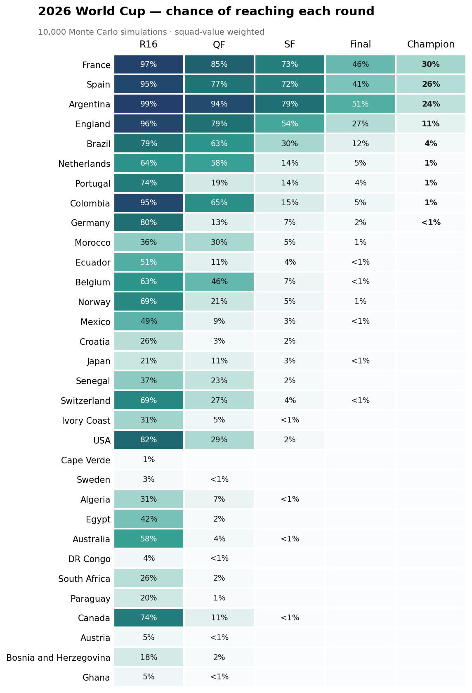

# 2026 FIFA World Cup — Match Prediction & Bracket Simulation

A machine-learning pipeline that predicts international match outcomes and simulates the 2026 World Cup knockout bracket to estimate each team's odds of reaching every round. Built as a learn-by-doing project: every stage was written to understand a concept, not just to produce a number.

## The core idea

Predicting a World Cup champion directly is close to hopeless — there have only ever been a couple dozen tournaments, far too few examples for a model to learn from. So the problem is reframed: instead of predicting the rare event (the winner), the model predicts the common one (a single match), trained on roughly 49,000 historical internationals. A Monte Carlo simulation then plays the bracket 10,000 times, letting those match probabilities decide each game, and counts how often each team ends up champion. The rare-event answer emerges from many repetitions of the common-event model.

## How the pipeline fits together

The project is a chain of small scripts, each consuming what the previous one produced.

**`make_elo.py`** walks every match in chronological order and maintains an Elo rating for each national team, using an eloratings.net-style scheme: the K-factor scales with the importance of the fixture (friendlies move ratings little, World Cup matches a lot), a goal-margin multiplier rewards decisive wins, and a home-advantage bonus is applied to the host side. Crucially, it records each team's rating *as it stood before* each match, so historical games are never contaminated with future strength.

**`02_features.py`** turns raw match rows into model-ready numbers, one row per match, written from the home team's perspective. The features are differences rather than raw values — `elo_diff` (home minus away strength), `form_diff` (each team's average points over its recent games, computed so the current match is excluded), and a neutral-venue flag. The target is the result: away win, draw, or home win. FIFA ranking was deliberately dropped, since Elo already captures relative strength.

**`03_train.py`** fits a logistic regression and evaluates it honestly. The train/test split is chronological — older matches train, recent matches test — mirroring the real task of forecasting games that haven't happened. Performance is measured with log-loss against a baseline that ignores the features entirely, so the comparison rewards calibrated probabilities rather than lucky guesses.

**`04_simulate.py`** is the bracket simulator. Because there are only 32 teams, it precomputes every possible pairwise matchup probability once, then reuses that lookup table across 10,000 simulated tournaments. Drawn knockout games are resolved by a penalty shootout weighted toward the stronger side. An optional squad-value prior can be layered on top (see below).

**`05_bracket_viz.py`** re-runs the simulation while tracking how far each team advances in every tournament, then renders the round-by-round survival probabilities as a heatmap.

## Methodology choices worth noting

- **Leakage prevention is the central discipline.** The single biggest risk in the whole project is letting a feature peek at information that wouldn't have existed at match time. Both Elo and recent form are constructed to use only pre-match data; the chronological split extends the same logic to evaluation.
- **Probabilities over hard labels.** The simulator needs calibrated three-way probabilities, not a single predicted winner, so the model is scored with log-loss and the baseline is probabilistic too — an apples-to-apples comparison.
- **Differences, not raw values.** Encoding each match as a difference between the two teams lets the model generalize to pairings it has never seen, which is exactly what the knockout rounds demand.

## The squad-value prior

The trained model learns only from results, and on that basis it ranks Argentina as the strongest team. A separate belief — that France's squad depth makes them the favorite — isn't something the historical data can support, partly because per-match historical squad values don't exist to train on, and attaching current values to old matches would be the same leakage trap as Elo.

So squad value is applied transparently as a post-model adjustment rather than a trained feature: each matchup's odds are nudged in log-odds space by the squad-value gap, scaled by a single tunable weight. This is a deliberate, controllable way to combine a model with domain belief — a form of opinion pooling — and it is leakage-free precisely because it never touches training. The important honesty point: that weight is chosen by hand, so any output using it is a squad-value-*weighted* forecast, not a claim about what the data alone implies.

## Findings

The model comfortably beats the no-features baseline (log-loss around 0.87 versus roughly 1.05), with accuracy near 60%. Elo carries most of the predictive signal; recent form adds only a little. Left to the data alone, the simulation favors Argentina. With the squad-value prior applied at a moderate setting, France edges narrowly ahead of Spain and Argentina in a tight top three — a direct illustration of the difference between what a model concludes and what a modeler chooses to believe.

## Data sources

Match results come from the martj42 international football results dataset (~49,000 matches back to 1872). Squad market values are sourced from Transfermarkt. The Elo methodology follows the refinements documented at eloratings.net.

## Scope and honesty

This is a learning project built around three features and a logistic regression, with a hand-set prior reflecting the author's own read of the tournament. It is best understood as an exercise in the *method* — framing, leakage avoidance, calibration, and the honest separation of model from belief — rather than as an authoritative forecast of who will win.